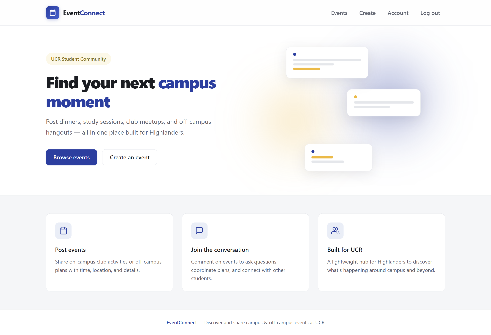
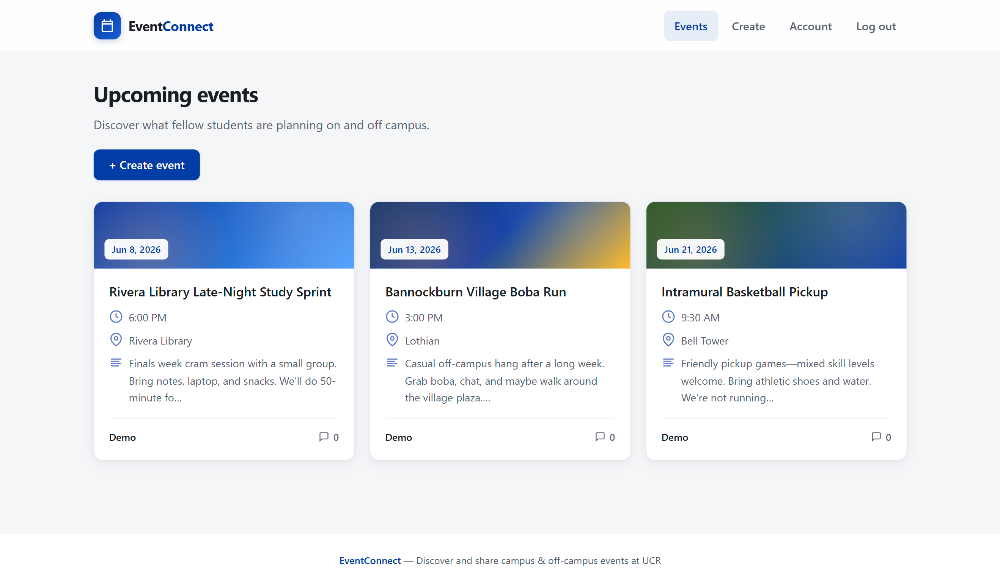
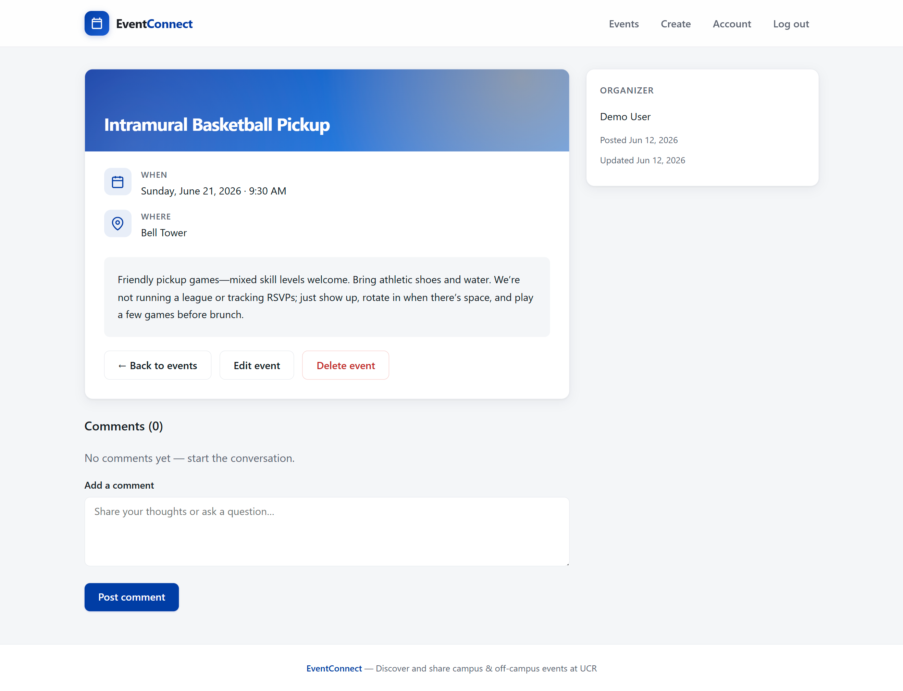

# EventConnect

## Overview
EventConnect is a website that helps UCR students organize and find on- and off-campus activities. The school provides a list of club activities, all of which take place on campus. Due to limited activity options, many clubs decided to meet outside after their on-campus meetings. FindTheEvent is a place where you can post activities, including going to restaurants, playing games, and watching movies. On this website, only students with their UCR email accounts can create profiles, and everyone can create event posts and manage the number of people who can join these events.

## What You Can Do

- **Browse events** — See what other students are planning, from club meetups to dinners, games, and movie nights.
- **Post your own events** — Share time, location, and details so others can find and join you.
- **Join the conversation** — Comment on events to ask questions, coordinate plans, or learn more before you go.
- **Build your profile** — Sign in with your account to personalize how you appear when you post or comment.

## Who It's For

EventConnect is built for **UCR students** who want one place to discover social and student-led activities—on campus and beyond—without digging through scattered group chats or flyers.

## Getting Started

If you are **using the live site**, create an account or sign in, then open **Events** to browse or post.

If you are **setting up the project on your computer** (for class, demos, or development), follow the installation guide below.

> **Demo note:** For coursework and live demos, the database may be kept **shared or publicly reachable** so teammates and reviewers can try the app without extra configuration. **In a production environment**, user data would sit in a **private, access-controlled store** with restricted credentials and network access—not exposed for convenience.

**Try the demo:** username `test` · password `test789456123` (see [Installation](docs/Installation.md#demo-login-shared--public-database) for details).

## Documentation

- [Installation & Usage](docs/Installation.md) — How to install dependencies, connect the database, and run the app locally.
- [Developer Documentation](docs/dev-doc.md) — Technical scope, architecture, and feature specifications for the team.

## Preview

**HomePage**

**EventPage**

**EventDetailPage**

## Disclaimer

This project was originally built as a CS110 class assignment by a team of three students (including me). The version in this repository reflects additional work I remodeled the UI for demonstration purposes.